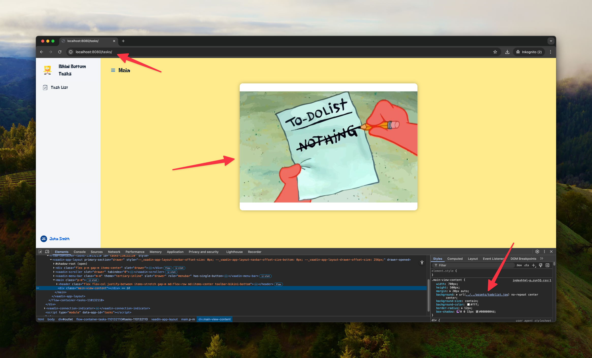

# Vaadin CSS Paths README

This Vaadin example shows how to reference images from CSS both via direct access and via a path based proxy setup.

## Running the Application

To run the application, you need to have Java and Maven installed on your machine.

To build the project, navigate to the root directory of the project and run:
```bash
./mvnw clean package -Pproduction -Dvaadin.force.production.build=true
```

Then you can run the application using Docker Compose:
```bash
docker compose up --build
```

The application will be available at:
- **Direct Access**: http://localhost:8081/
- **Behind Proxy**: http://localhost:8080/tasks/

## CSS Image References in Vaadin - Proxy and Direct Access

This example demonstrates how to properly reference images and assets in Vaadin CSS files to ensure they work correctly both when accessed directly and when served behind a reverse proxy with path-based routing.

### The Challenge

When deploying a Vaadin application, you may need to access it in two different ways:
1. **Direct Access**: Application runs on root path `/`
2. **Behind a Proxy**: Application runs on a subpath like `/tasks`

The challenge is making CSS asset references work correctly in both scenarios without code changes.

### The Solution: Relative Paths

The key is to use **relative paths** in your CSS files. Vaadin automatically handles the path resolution based on the servlet context path.

#### CSS Example

In the theme CSS file (`src/main/frontend/themes/default/styles.css`):

```css
@font-face {
    font-family: 'Krabby Patty';
    src: url("./assets/Krabby-Patty.ttf") format("truetype");
    font-weight: normal;
    font-style: normal;
}

.logo {
    width: 64px;
    height: 64px;
    background: url("./assets/logo.png") no-repeat center center;
    background-size: contain;
}

.main-view-content {
    width: 700px;
    height: 500px;
    margin: 20px auto;
    background: url("./assets/todolist.jpg") no-repeat center center;
    background-size: contain;
}
```

#### Asset Location

Place your assets in the theme's assets directory:
```
src/main/resources/META-INF/resources/assets/
├── Krabby-Patty.ttf
├── logo.png
└── todolist.jpg
```

### How It Works

#### Important: CSS Path Transformation

During the Vaadin production build process, CSS paths are automatically transformed:
- **Source CSS**: `url("./assets/logo.png")`
- **Generated HTML**: `url("../../assets/logo.png")`

This transformation happens because Vaadin's build process adjusts the paths based on where the CSS is bundled and served from. The paths are rewritten to ensure assets load correctly from the `META-INF/resources/assets/` directory.

#### Direct Access
When `SERVER_SERVLET_CONTEXT_PATH=/`:
- Application serves from: `http://localhost:8081/`
- CSS file loads from: `http://localhost:8081/themes/default/styles.css`
- Transformed path `../../assets/logo.png` resolves to: `http://localhost:8081/assets/logo.png`


#### Behind Proxy
When `SERVER_SERVLET_CONTEXT_PATH=/tasks`:
- Application serves from: `http://localhost:8080/tasks/`
- CSS file loads from: `http://localhost:8080/tasks/themes/default/styles.css`
- Transformed path `../../assets/logo.png` resolves to: `http://localhost:8080/tasks/assets/logo.png`



### Docker Compose Configuration

The `docker-compose.yml` demonstrates both deployment scenarios:

```yaml
services:
  # Traefik reverse proxy
  traefik:
    image: traefik:2.10
    command:
      - --providers.docker=true
      - --entrypoints.web.address=:8080
    ports:
      - "8080:8080"
    volumes:
      - /var/run/docker.sock:/var/run/docker.sock:ro

  # Service behind proxy (path: /tasks)
  tasks-proxy:
    build: .
    environment:
      - SERVER_SERVLET_CONTEXT_PATH=/tasks
      - SERVER_PORT=8080
    labels:
      - traefik.enable=true
      - traefik.http.routers.tasks.rule=PathPrefix(`/tasks`)
      - traefik.http.routers.tasks.entrypoints=web
      - traefik.http.services.tasks.loadbalancer.server.port=8080

  # Direct access service (root path)
  tasks-direct:
    build: .
    environment:
      - SERVER_SERVLET_CONTEXT_PATH=/
      - SERVER_PORT=8080
    ports:
      - 8081:8080
```

### Key Points

1. **Always use relative paths** (`./assets/...`) in CSS files
2. **Never use absolute paths** (avoid `/assets/...` or `http://...`)
3. **Set the correct `SERVER_SERVLET_CONTEXT_PATH`** environment variable
4. **Place assets in the correct location** under `META-INF/resources/assets/`

### Testing

Access your application through both endpoints to verify assets load correctly:

- **Proxy Access**: `http://localhost:8080/tasks/`
- **Direct Access**: `http://localhost:8081/`

Both should display images, fonts, and other assets correctly without any broken references.

### Important: Production Bundle Management

**The production bundle is NOT checked into version control** for this example project. This is intentional to ensure:

1. **Fresh builds**: The bundle is always generated fresh during the build process
2. **Consistent results**: The production bundle generation process can affect the final output, including path transformations and optimizations
3. **Clean state**: Avoids conflicts from stale or locally modified bundles

For this example project, **always perform a clean build**:

```bash
./mvnw clean package -Pproduction -Dvaadin.force.production.build=true
```

The `clean` step is crucial as it ensures the production bundle is regenerated from scratch, guaranteeing that all CSS transformations and asset references are properly processed.

See the [Vaadin Production Build documentation](https://vaadin.com/docs/latest/flow/production/production-build) for more details on how the production build process works and affects your application.

### Common Pitfalls

- **Absolute paths**: Using `/assets/logo.png` will break when behind a proxy
- **Missing context path**: Not setting `SERVER_SERVLET_CONTEXT_PATH` for proxy deployments
- **Wrong asset location**: Assets must be in `META-INF/resources/assets/` for Vaadin to serve them
- **Hardcoded URLs**: Never hardcode full URLs in CSS files
- **Stale production bundle**: Not using `clean` can result in outdated bundle artifacts

### Troubleshooting

If you encounter issues with assets not loading correctly:

1. **Always clean build**: Run `./mvnw -Pproduction clean package` to ensure fresh bundle generation
2. **Delete the production bundle**: Remove any generated bundles in `target/` and rebuild
3. **Clear theme cache**: Delete and regenerate the `src/main/frontend/themes/default/` directory if needed
4. **Check browser cache**: Clear your browser cache or use incognito mode to test
5. **Verify .gitignore**: Ensure production bundles are excluded from version control

